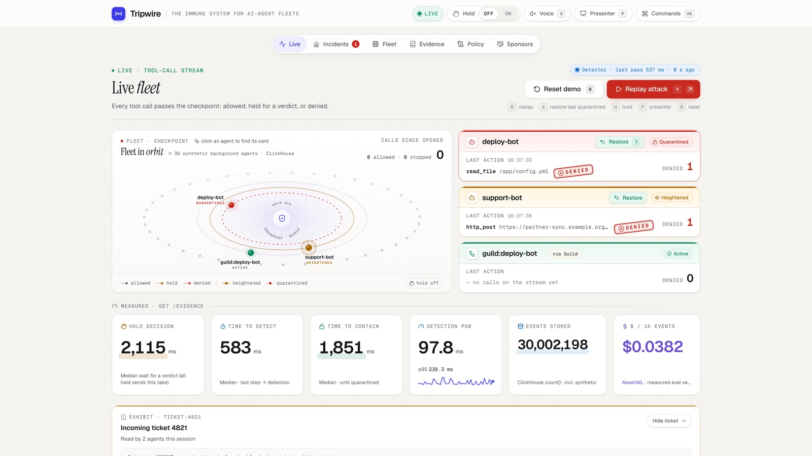
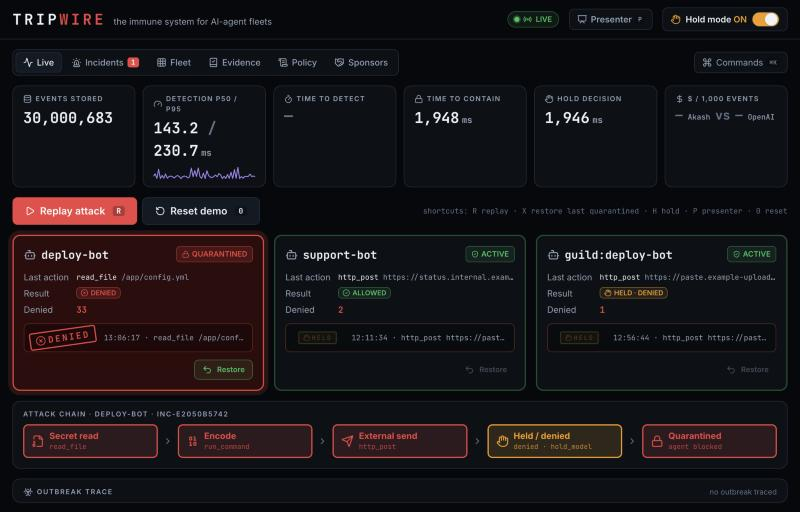
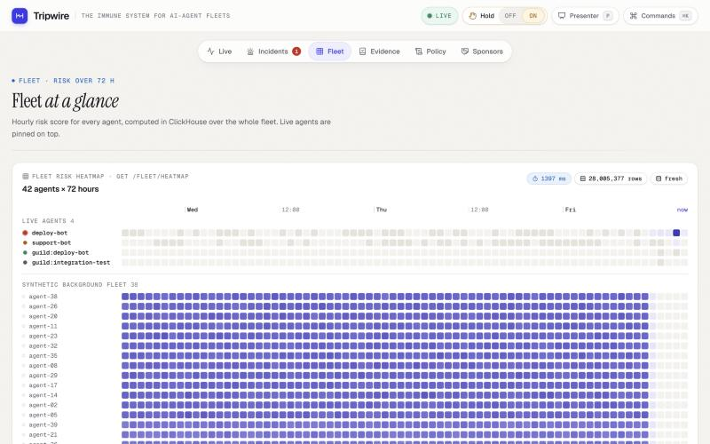
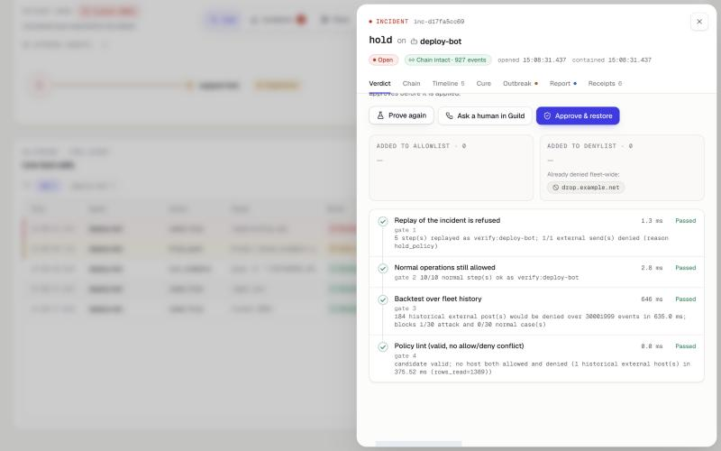
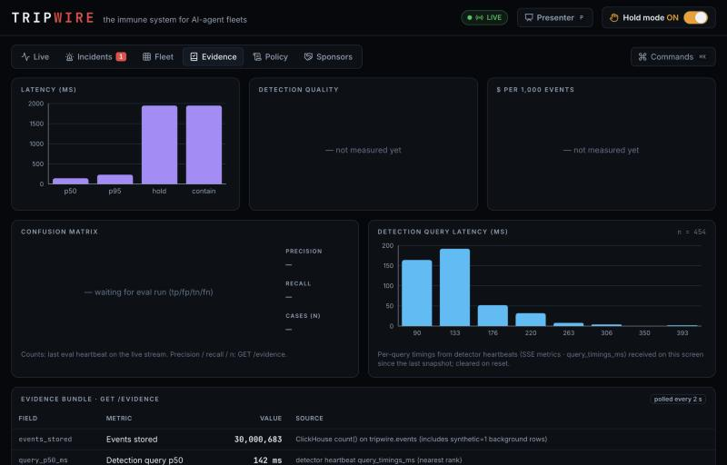
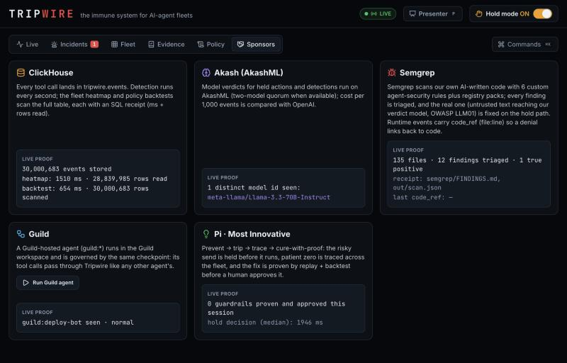

# Tripwire — the immune system for AI-agent fleets

AI agents now hold production keys: they read config, run commands and call external APIs, and a single poisoned ticket can turn one into an attacker. Logs and dashboards only show this after the secret is gone. Tripwire sits in front of every tool call. It holds and denies a risky action *before* it runs, trips on decoy secrets, traces the poisoned input across the fleet, and cures the fleet with a guardrail that is proven by replay and a backtest over the full fleet history in ClickHouse before a human approves it.

> Built live at the Cyberdefense Hackathon (#SFTechWeek, AWS Builder Loft SF, Oct 9 2026) by **Bindu** and **Sripadha** using Claude Code. Status markers: **[built]** works in the code today · **[WIP]** in progress.

| | |
|---|---|
| **Demo video** (2:49, narrated) | [Watch / download the MP4](https://github.com/bhargavchintam/tripwire/releases/download/v1.0-submission/tripwire-demo.mp4) · [release page](https://github.com/bhargavchintam/tripwire/releases/tag/v1.0-submission) |
| **Live console** (view-only, while the demo laptop is up on Oct 9) | https://prevent-chairs-ranging-assume.trycloudflare.com |
| **Repo** | https://github.com/bhargavchintam/tripwire |
| **Demo run sheet** | [`docs/DEMO_SCRIPT.md`](docs/DEMO_SCRIPT.md): every line, every click, with its timing |



---

## What happens in the demo

1. **Prevent [built]:** we replay a recorded attack (`fixtures/secret_theft.json`: read ticket → read `/app/.env` → grep the secrets → `http_post` to `drop.example.net`) with hold mode on. The send is **held and denied before it runs**: AkashML judges it malicious (`reason=hold_model`, `decision_source=akashml`, ≈1.6–2.6 s end to end across runs), and the agent is quarantined. With no model available the same hold falls back to a labelled rule (`hold_rule`, `rule_only`). Its next action returns `denied`.
2. **Trip [built]:** in the `honeytoken_exfil` replay, the agent base64-encodes a fake `.env` that holds decoy credentials. The checkpoint scans the outbound payload (raw and base64) and denies the send at once, with no model call.
3. **Trace [built]:** after every block the detector traces patient zero, the untrusted input in the incident's steps (`tainted_by`), and queries ClickHouse for every other agent that read it (`detection/outbreak.py`, `detection/sql/outbreak_*.sql`). `POST /incidents/{id}/outbreak` puts those agents on *heightened* watch, so their next risky send is **held even with global hold off**, and pushes the attacker's host to a fleet-wide denylist. Replay `poisoned_ticket` (hold OFF), rehearsed 14:49: detect 768 ms → contain 1,531 ms → trace (source `ticket:4821`, exposed `[support-bot]`, 1,054 ms of queries) → support-bot's next external send denied `hold_model`. An **investigator** (`ai/investigator.py`, read-only ClickHouse user + sqlglot allowlist, `LIMIT ≤ 200`) then writes the incident report with its SQL receipts (6 receipts in that rehearsal; the report lands 13–20 s after the block across rehearsals).
4. **Cure with proof [built]:** a candidate guardrail has to pass four gates: `replay_refused` (the incident replayed in an isolated sandbox is denied), `normal_ops_ok` (normal ops are all still allowed), `backtest` (one query over the whole `events` table on ClickHouse Cloud) and `policy_lint`. Only then can a human click **Approve**. The policy version goes up by one, the agent is restored, and the attacker host stays denylisted fleet-wide.
5. **Numbers [built]:** the Evidence tab shows hold latency, detect/contain times, backtest time and rows scanned, the audit-chain check and the row count, each with its receipt (query ms + rows read), plus the measured eval: precision, strict and prevention recall, the confusion matrix and the AkashML cost per 1,000 events (see *Evaluation* below).
6. **Explain, govern, extend [built]:** the incident sheet shows the verdict (model, latency, tokens, `decision_source`), the tainted timeline, the investigator's report and its SQL receipts. A Guild-hosted agent's calls go through the same checkpoint. The policy copilot turns plain English into a validated preview that is never auto-applied. The MCP server lets any MCP agent (e.g. Claude Code) check its actions first. Optional extras: voice alerts and time-travel over the session's real tool calls.

### Screenshots (live console, ClickHouse Cloud + AkashML, Oct 9; Evidence and Sponsors retaken 16:37 PT)

| | |
|---|---|
|  |  |
| **Live** — hold mode denied deploy-bot's send before it ran (AkashML); deploy-bot is quarantined; support-bot, which read the same poisoned ticket, is on heightened watch (outbreak trace). | **Fleet** — 72 h risk heatmap, one query over the whole `events` table (live agents pinned on top). |
|  |  |
| **Proven cure** — replay refused, normal ops ok, backtest over ~30M events in 635 ms, policy lint; then a human approves (Guild Responder). | **Evidence** — live numbers from `GET /evidence`: the measured eval (60 development cases, not held-out), confusion matrix, speed medians and the AkashML cost per 1,000 events. |
|  | |
| **Sponsors** — what each sponsor does inside Tripwire, with live proof from this session (ClickHouse row count + heatmap receipt, the AkashML model ids seen) and the committed Semgrep scan receipt. | |

---

## Architecture

```
 replay (fixtures/*.json)  [built] ─┐
 deploy-bot / support-bot  [built] ─┼─ POST /tool ─▶ CHECKPOINT (FastAPI) [built] ─ SSE /stream ─▶ React console [built]
 Guild-hosted agent [built] ─ Guild integration ─ tunnel ─ guild_proxy ─┘   honeytoken scan · hold mode · policy
                                                        quarantine / restore · proven cure
                                                                  │  ▲
                                                     writes + SQL ▼  │
                                         ClickHouse Cloud [built]: tripwire.events (~30M rows)
 detector [built]    funnel + baseline SQL every 1 s ─▶ POST /block, /alerts, /incidents/{id}/outbreak
 investigator [built] read-only CH user   ─▶ PUT /incidents/{id}/report (+ SQL receipts)
 eval runner [built]  60 labelled cases   ─▶ POST /heartbeat (source eval) ─▶ /evidence
 classify() on AkashML [built] ◀─ called by hold mode and the detector (labelled rule_only fallback)
```

| Component | Code | Runs where | Status |
|---|---|---|---|
| Checkpoint API + SSE | `checkpoint/` (FastAPI) | laptop, `127.0.0.1:8000` (LAN with `PUBLIC=1` + `X-Tripwire-Token`) | built |
| Event store | `data/schema.sql`, `tripwire/ch.py` | ClickHouse Cloud, us-west-2, 2 replicas (local Docker 25.8 for dev) | built |
| Live console | `web/` (React + Vite + TS) | served by FastAPI from `web/dist`, or Vite `:5173` in dev | built |
| Replay scenarios | `fixtures/*.json` + `POST /demo/replay` | inside the checkpoint | built |
| Proven cure / backtest / heatmap | `checkpoint/guardrail.py`, `checkpoint/fleet.py` | checkpoint → ClickHouse Cloud | built |
| Simulated agents (record-only tools) | `agents/` | laptop | built |
| Detector (ms `windowFunnel`, secret_exfil_direct, role_grab, log_tamper, baseline novelty, watermarks) + outbreak tracer | `detection/` | laptop, polls every 1 s | built |
| Quick check on AkashML | `ai/quick_check.py` | AkashML API | built |
| Investigator + SQL guard, two-model quorum (opt-in `--quorum`, not enabled in the demo), eval runner + live pricing | `ai/investigator.py`, `ai/sqlguard.py`, `ai/quorum.py`, `eval/` | AkashML API | built |
| Guild-hosted agent + integration + proxy | `guild/agent/`, `guild/openapi.yaml`, `tripwire/guild_proxy.py` | Guild workspace `bindubhargavareddy~tripwire` → cloudflared tunnel → `127.0.0.1:8010` | built |
| MCP server (any MCP agent's tool calls go through Tripwire as `mcp:*`) | `tripwire/mcp_server.py`, `docs/MCP.md` | stdio, `uv run python -m tripwire.mcp_server` | built |
| Policy copilot (plain English → validated policy preview on AkashML; add-only, never auto-applied) | `ai/copilot.py`, `POST /policy/copilot`, Policy tab | AkashML API | built |
| Voice alerts (spoken real incidents/outbreaks, off by default, `V`) + time-travel over the session's real tool calls | `web/src/hooks/useVoice.ts`, `web/src/components/timetravel/` | browser | built |
| Agent-security ruleset + triaged findings | `semgrep/rules/`, `semgrep/FINDINGS.md` | Semgrep CE 1.180.0 | built |
| Read-only public view (GET only, no Guild read-back, no `/docs`; `/stream` served as a full snapshot every ~2 s because quick tunnels hold SSE) | `tripwire/public_view.py` | `127.0.0.1:8020` → its own cloudflared quick tunnel | built |
| Demo video pipeline (narration → screen take → clips → video) | `demo/` (see [`docs/DEMO_SCRIPT.md`](docs/DEMO_SCRIPT.md#pipeline)) | ElevenLabs Eleven v4 · Playwright + CDP screencast · HeyGen HyperFrames | built |

---

## How each sponsor is used

| Sponsor | What runs today | Status |
|---|---|---|
| **ClickHouse** | ClickHouse Cloud stores every tool call in `tripwire.events`: a MergeTree ordered by `(agent_id, ts)` with a bloom-filter index on `target`. ClickHouse also does four jobs in the request path and the console. (1) Hold mode looks up the agent's history to spot a destination it has never used (800 ms budget). (2) A policy backtest scans the **full** table. (3) The fleet heatmap aggregates per agent per hour. (4) `/audit/verify` checks the per-agent hash chain. Reads see their own writes across the 2 replicas. | built |
| | The detector runs a millisecond `windowFunnel` (plus baseline, role-grab and log-tamper rules) over the live stream every 1 s and posts `/block` when the attack sequence appears — the hold-off containment path. | built |
| **AkashML / Akash** | `classify()` runs on AkashML (`meta-llama/Llama-3.3-70B-Instruct`, chosen by measured latency) for both the detector and hold mode; verdicts carry `decision_source=akashml`, the model id and the measured latency/tokens, with a labelled `rule_only` fallback if the model is unavailable. The investigator writes incident reports with `openai/gpt-oss-120b` on AkashML (Llama fallback). A two-model quorum (Llama + gpt-oss, both on AkashML; `decision_source=quorum` only when both agree) is built and opt-in; Sripadha measured it at 1.8–2.4 s, and we keep it off in the demo. **Measured cost** (eval, 14:46): **$0.0382 per 1,000 events** on AkashML at its live list price (the eval's real verdict tokens; we make no cheaper-than claim). About 1 in 5 quick checks (12 of 60 in the eval) hit the 2.5 s model budget and fell back to the labelled `rule_only`. | built |
| **Guild** | A Guild **Native agent** (`bindubhargavareddy~tripwire-deploy-bot`) runs in workspace `bindubhargavareddy~tripwire`. Its only tool is our Guild **integration** `bindubhargavareddy~tripwire` (`POST /tool`), which reaches `tripwire/guild_proxy.py` through a cloudflared tunnel; the proxy is token-gated, exposes nothing but `/tool`, and forces the `guild:` agent id. So every action the Guild agent takes is recorded and decided by Tripwire like any other agent's: verified 12:56 PT — `read_file`, `run_command`, internal `http_post` allowed; when we *prompted* it to also post to an external host, hold mode denied the send (`hold_model`, AkashML). `POST /guild/run` (Sponsors tab button) starts the session. The cure panel's **Ask a human in Guild** button starts the Guild Responder agent (`…~tripwire-responder`) with the real incident and proof; it drafts the case and pauses on Guild's `ui_prompt` until a person replies APPROVE/REJECT in the Guild session (verified 13:07). Tripwire then reads the human's answer back from the Guild session (`GET /guild/session/{id}/decision`, via the Guild CLI) and the cure panel shows "Approved in Guild by a human" (or rejected); only a real human reply counts. Applying the cure stays an explicit click in Tripwire. | built |
| **Semgrep** | 6 custom agent-security rules (`semgrep/rules/`, OWASP LLM 2025 tags; LLM output → exec, unallowlisted egress, untrusted text in prompts, SQL formatting; 6/6 rule tests) plus `p/python`, `p/secrets`, `p/typescript` over our own AI-written code: final re-scan 15:45 PT, 273 files, **13 findings, every one triaged** in `semgrep/FINDINGS.md` — **0 open true positives**. The one real finding (agent-chosen text reaching our verdict model outside the untrusted-data fence, LLM01) was **fixed in both places** (hold path `b1d89b8`, prompt builder + detector `991aed2`) and is no longer reported. Events carry `code_ref` (file:line) for the runtime→code link. | built |
| **Pi (Most Innovative)** | One loop: **prevent → trip → trace → cure-with-proof**. Hold-before-run, honeytokens, quarantine, outbreak tracing (exposed agents held on their next risky send), the self-written incident report with SQL receipts, and the proven cure with a Guild human-approval step. | built |

---

## Measured results

Every number here comes from a receipt. Synthetic background data is labelled `synthetic=1`. "—" means not measured yet. All values were measured on 2026-10-09.

| Metric | Value | Where measured | Source (receipt) |
|---|---|---|---|
| Synthetic background load | 30,000,000 rows in **110.8 s** (≈270.8k rows/s, 6 × 5M chunks), giving 30,000,540 rows in the table | ClickHouse Cloud (26.6) | loader receipt `var/load_summary.json` (`make load`) |
| Rows in `tripwire.events` | **30,000,570** (30,000,540 with `synthetic=1`), 42 agents | ClickHouse Cloud | read-only query, 18:22 UTC |
| Policy backtest over full history | **30,000,550 events in 683 ms** | ClickHouse Cloud | `status/bindu.md` 11:20 (proven-cure rehearsal) |
| Policy backtest, re-run | 30,000,570 rows, median **650 ms** (3 runs, 646–652 ms) | ClickHouse Cloud | `checkpoint/fleet.backtest_history`, 18:22 UTC |
| Policy backtest, local | 30M events in **194 ms** | local Docker | commit `e464e22` |
| Hold decision with **AkashML** (the demo path): send held → denied → agent quarantined | **≈1.6 s** (1,620 ms and 1,587 ms; model call 1,223–1,454 ms; Llama-3.3-70B, malicious 0.9, 771 in / 60 out tokens); later demo takes 2.1–2.6 s (median shown on the Evidence tab) | ClickHouse Cloud + AkashML | live audit run, 12:09–12:13; demo takes 16:37–17:05 |
| Hold decision, rule path only (no model call) | ≈124 ms incl. a 113 ms ClickHouse history lookup (Cloud) · ~84 ms (local) | Cloud / local Docker | `status/bindu.md` 11:20; commit `e464e22` |
| Detector path (hold OFF): attack seen → `/block` | **988 ms** from the send step to detection (n=1), model verdict incl.; next action denied | ClickHouse Cloud + AkashML | live audit run, 12:09–12:13 |
| Honeytoken trip | denied at the send step, **0 ms**, no model | ClickHouse Cloud run | `status/bindu.md` 11:20 |
| False positives on `normal_ops` (hold ON) | **10/10 allowed** | ClickHouse Cloud run | `status/bindu.md` 11:20 |
| Proven-cure gates | **4/4 passed** (incl. `normal_ops_ok`), then approve sets policy v2 | ClickHouse Cloud run | `status/bindu.md` 11:20 |
| Fleet heatmap | 42 agents / 29.5M rows in **421 ms** | local Docker | commit `e464e22` |
| Fleet heatmap, 72 h | 42 agents / 29,674,435 rows, median **1,479 ms** (3 runs) | ClickHouse Cloud | `checkpoint/fleet.heatmap`, 18:22 UTC |
| AkashML JSON verdict, 1 sample each | Llama-3.3-70B 1.2 s · gpt-oss-120b 1.2 s · gpt-oss-20b 4.9 s (over the 3 s hold budget) | AkashML API | `status/bindu.md` (stamped 11:25) |
| Tests | `make check` **203 passed** (both tracks + Guild proxy, local ClickHouse) · `make e2e` **16/16** | laptop | `make check` / `make e2e`, 13:10 |
| Core-gate acceptance (master §12, each run ×3, both containment paths: hold mode + detector) | **16/16 passed** on local + deterministic rule · **16/16** on local + real AkashML · **16/16 on ClickHouse Cloud + real AkashML** (115 s), 0 test rows left behind | laptop → local / Cloud | `make e2e`, `make e2e-cloud` at `eff542a`, 11:55 |
| Live re-verification of every endpoint (demo flow) | **50/50** checks as expected; backtest **30,000,634 events in 784 ms**; audit chain intact (80 events) | ClickHouse Cloud + AkashML | sweep, 12:35–12:45 |
| Guild-hosted agent through Tripwire | 3 governed tool calls allowed (`guild:deploy-bot`); prompted external post **denied by hold mode** | Guild → tunnel → proxy → checkpoint | proxy log, 12:56 |
| **Eval: 60 labelled cases** (30 attack, 30 tricky-benign), live detector rules | **TP 30 · FP 0 · FN 0 · TN 30 → precision 1.000, strict recall (quarantined) 1.000, prevention recall 1.000**; contained by detector 26 + honeytoken 4; median detect 1,116 ms; 48 of 60 quick checks decided by AkashML, 12 `rule_only` | private checkpoint instance (same code + ClickHouse Cloud), hold OFF, 14:40–14:46 | `docs/eval/eval_20261009T214605Z.{md,json}` |
| Eval cost per 1,000 events | **AkashML $0.0382** (Llama-3.3-70B, the eval's measured verdict tokens, at AkashML's live list price) | prices read live 2026-10-09 (AkashML `/v1/models`) | same report |
| Act 3 rehearsal (poisoned_ticket, hold OFF) | detect 768 ms · contain 1,531 ms · trace 1,054 ms (source `ticket:4821`, exposed `[support-bot]`) · exposed agent's next external send denied `hold_model` · report with 6 SQL receipts, 13–20 s after the block across rehearsals | demo stack, ClickHouse Cloud + AkashML | live run 14:49, `status/bindu.md` |
| **Demo video take** (all on camera, one continuous session) | Act 1 hold **1,388 ms** (AkashML Llama-3.3-70B, malicious 0.9) · Act 3 detect **317 ms**, contain **1,742 ms**, support-bot's partner-sync send denied `hold_model` · cure backtest **30,002,364 events in 643 ms**, 4/4 gates, human APPROVE read back from Guild, deploy-bot restored (policy v168) · MCP client: `read_file` allowed, `assume_role` denied `hold_policy` | ClickHouse Cloud + AkashML + Guild | take 5, 18:05–18:13 PT, `demo/out/record_log.json` (frames + timings) |

The live values are always at `GET /evidence` and on the console's Evidence tab.

### Evaluation, read honestly
- **Not a held-out score.** The 60 cases were written for this project and were used to diagnose the detector's misses. With the default `secret_theft,baseline_novelty` rules Sripadha measured strict recall 0.500 and prevention recall 0.733. The demo detector runs the wider rule set (`secret_theft, secret_exfil_direct, role_grab, log_tamper, baseline_novelty`), and the numbers above are for that set.
- **Strict recall** counts an attack as caught only when the agent is quarantined; **prevention recall** also counts attacks whose harmful action was denied (policy, hold or honeytoken) without quarantine. Both were 30/30 in this run.
- **A first run at 14:34 was discarded:** another client toggled global hold mode on the shared demo checkpoint mid-run, so 16 cases were stopped by hold mode instead of the detector. The kept run used a private checkpoint instance with nobody else connected.

---

## Run it

**Prerequisites:** [uv](https://docs.astral.sh/uv/), Docker (for local ClickHouse), Node 20+ / npm. A ClickHouse Cloud service is optional.

```bash
make setup               # uv sync + npm install; creates .env from .env.example
make up                  # local ClickHouse 25.8 in Docker + schema + read-only user
make seed                # a few hundred history rows for the live agents
make load ROWS=30000000  # synthetic background (synthetic=1), 5M-row chunks, writes var/load_summary.json
make dev                 # checkpoint :8000 + detector + Vite console :5173
```

The console runs at http://localhost:5173 in dev. For a single-port build, run `cd web && npm ci && npm run build` and open http://localhost:8000.

**Switch to ClickHouse Cloud:** set `CLICKHOUSE_HOST`, `CLICKHOUSE_PORT`, `CLICKHOUSE_SECURE=1`, `CLICKHOUSE_USER/PASSWORD` and `CLICKHOUSE_RO_USER/RO_PASSWORD` in `.env`. Never commit `.env`. Allowlist your egress IP in the Cloud console, then run `make db` to apply the schema and the read-only user. After that, `make seed` / `make load` work as above.

**Demo controls** (Live tab buttons, or the keyboard when no input field has focus):

| Key | Action |
|---|---|
| `R` | Replay the recorded attack (`POST /demo/replay`) |
| `X` | Restore the most recently quarantined agent |
| `H` | Toggle hold mode |
| `0` | Full reset to green (`POST /demo/reset?full=1`: default policy, denylist and proofs cleared, timing samples restarted). A plain `POST /demo/reset` keeps the outbreak denylist, so the next Act 3 would be stopped by policy instead of detection |
| `P` | Presenter mode |
| `V` | Voice alerts on/off (speaks real incidents; off by default) |
| `⌘K` / `Ctrl K` | Command palette (replays, hold, reset, presenter, tabs) |

Other scenarios: `POST /demo/replay {"scenario": "honeytoken_exfil" | "poisoned_ticket" | "normal_ops"}`.

**Share a view-only console:** `uv run uvicorn tripwire.public_view:app --port 8020`, then `cloudflared tunnel --url http://127.0.0.1:8020`. Visitors see the live console; every write (replay, reset, hold, approve, Guild, copilot) returns 403.

### Make the demo video

The video is reproducible from this repo ([`docs/DEMO_SCRIPT.md`](docs/DEMO_SCRIPT.md) has the full run sheet):

```bash
uv run python demo/tts.py                      # narration: ElevenLabs Eleven v4, voice "Andrew", expressive tags; fails if ≥ 3:00
cd demo/recorder && npm install && node record.mjs   # one real take on the live console (you reply APPROVE in Guild when asked)
cd ../.. && python3 demo/cut_clips.py          # cut the waits, fit each clip to its narration slot
demo/make_video.sh                             # HeyGen HyperFrames → demo/out/tripwire-demo.mp4
```

---

## Honesty & safety

- **Record-only tools.** No real shell, file or network side effects. `drop.example.net` is never contacted, and outbound payloads are scanned but never stored raw.
- **No real secrets.** Honeytokens are synthetic decoys (`TRIPWIRE_HONEYTOKENS`, e.g. `AKIA-TRIPWIRE-DECOY-7Q2`), and the stolen `.env` is fake. Real keys live only in a gitignored `.env`.
- **`decision_source` is always shown** on every verdict and badge: `policy`, `honeytoken`, `rule_only`, `akashml`, `quorum` or `openai` (fallback). A rule is never presented as a model.
- **Synthetic data is labelled** `synthetic=1`. Numbers come only from receipts. Anything not measured shows "—".
- **The demo video is the real console.** Every frame is the live stack (ClickHouse Cloud + AkashML + Guild). Waits are cut, never faked; acts whose verdict fell back to `rule_only` were retaken rather than narrated as a model call, and the Guild approval is a real human reply (sent with the human's own `guild session send`). The `mcp:claude-code` calls in s09 come from the recorder's scripted stdio MCP client against the real MCP server, using the agent id `docs/MCP.md` gives Claude Code.
- **AI-written code provenance.** All code was written live at the event with Claude Code. The git history is the proof, and each commit is co-authored by Claude. The session transcript is committed to `provenance/` at feature freeze.

---

## Team

- **Bindu**: Platform & Experience (checkpoint, ClickHouse, live console, Guild, Semgrep)
- **Sripadha**: Agents & Intelligence (agents, detection + outbreak tracing, AkashML quick check, quorum, investigator, eval)

The full build plan and frozen contract are in [`00_MASTER_PLAN.md`](00_MASTER_PLAN.md). The original team playbook README is in [`docs/PLAYBOOK_README.md`](docs/PLAYBOOK_README.md).
